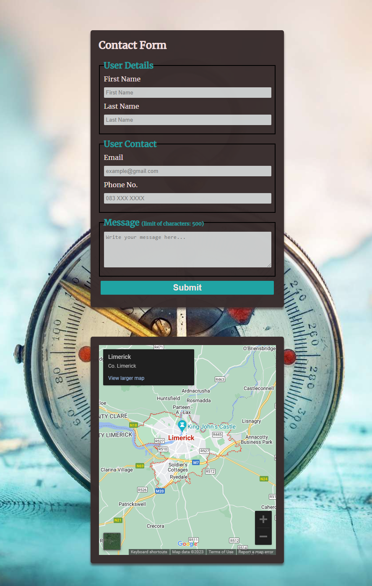

<h1 align="center">Travel Addict Website</h1>

[View the live project here](https://georgeh23.github.io/travel-addict/)

## Index – Table of Contents
* [Introduction](#introduction)
* [User Experience (UX)](#user-experience-ux) 
* [Features](#features)
* [Issues and Bugs](#issues-and-bugs)
* [Technologies Used](#technologies-used)
* [Testing](#testing)
* [Deployment](#deployment)
* [Credits](#credits)

## Introduction

Travel Addict is a website dedicated to travel offers throughout Europe. On our website you can see the best offers for dream locations. Our offers comprise of multiple locations, specially selected for the most pretentious adventure seekers. If you are a hiker and your in love with the landscapes offered by the mountain side, or you are a beach lover, seeking for the best sunrises and sunsets, or you are in love with the urban jungle and you like exploring different architectural styles as well as trying the best street foods throughout Europe, we got you covered.
Travel Addict's main goal is to help you set foot in your dream locations with as little hassle as possible, all at competitive prices. With us you can be sure your holidays will be something to talk about for years to come, and all this is just one click away.

## User Experience (UX)

-   ### User stories

    -   ### Ideal User Demographic
        * First Time user
        * Current user
        * Frequent User

    -   ### First Time User Goals

        1. As a First Time User, I want to easily explore website content.
        2. As a First Time User, I want to easily to understand what the website offers.
        3. As a First Time User, I want to easily navigate throughout the website pages.

    -   ### Current User Goals

        1. As a Current User, I want to visit easily and fast the website.
        2. As a Current User, I want to easily book a offer.
        3. As a Current User, I want to easily contact the companie.

    -   ### Frequent User Goals
        1. As a Frequent User, I want to see regular traveling offers updated.
        2. As a Frequent User, I want to see videos with different vacation places.
     
-   ### Development-Planes

    -   #### To create an accessible and easy-to-use website:
        1. Create a clear and logical structure.
        2. Choose good colors and fonds.
        3. Implement a responsiv design.

    -   ### Strategy
        1. Define Target Audience.
        2. Use-Friendly navigation.
        3. Create relevant content.
        4. Use attractive and high-quality images.
        4. Integrate Social Media.

    -   ### Scope
        1. Convert visitors into bookings.
        2. Keep the visitors interested in the content.
        3. Repeat bookings and referrals from customers.

-   ### Design

    -   #### The color palette used in the website:
        1. Primary Color: #A32020;
        2. Secundary Color: #F7E2E2.
        3. Accent Color: #20A3A3.
        4. Background Color: #FFFFFF.
        5. Text Color: #000000.

-   ### Typography

    -   #### The typography used in the website:
        1. Primary Font: [Merriweather](https://fonts.google.com/specimen/Merriweather?query=Merri)
        2. Accent Font: [Lobster](https://fonts.google.com/specimen/Lobster?query=lobster)
        * Both imported from [Google Fonts](https://fonts.google.com/)

-   ### Media Files, Text and Tools

    -   #### The Media Files used in the website:
        1. [Landing Image](https://stock.adobe.com/ie/images/id/299105798?clickref=1100lwH2jmJZ&mv=affiliate&mv2=pz&as_camptype=&as_channel=affiliate&as_source=partnerize&as_campaign=wbm&asset_id=299105798)
        2. [Mountain]( https://theuiaa.org/home/the-uiaa-integrates-respect-the-mountains/)
            - [Alpin Resort Sacher](https://www.tripadvisor.com/Hotel_Review-g319732-d291520-Reviews-Alpin_Resort_Sacher-Seefeld_in_Tirol_Tirol_Austrian_Alps.html)
            - [Hotel Zermama](https://www.kayak.com/Zermatt-Hotels-Admiral.186190.ksp)
            - [Chalet Tré la Vieux](https://www.booking.com/hotel/fr/chalet-arbogast.fr.html)
            - [Iframe Mountain](https://www.youtube.com/embed/-cqZjLVlkM8?start=21)
        3. [Sea](https://www.que.es/2023/02/14/destinos-romanticos-san-valentin/)
            - [Sunset Tropea](https://www.tripadvisor.co.uk/Hotel_Review-g194939-d12521094-Reviews-B_B_Tropeacentro-Tropea_Province_of_Vibo_Valentia_Calabria.html)
            - [Marina Suites Hotel](https://en.marinagrancanaria.com/hotel-marina-suites-in-canary-islands/)
            - [Hotel ManasPark](https://www.tripadvisor.com.tr/Hotel_Review-g312737-d1943550-Reviews-Manaspark_Deluxe_Hotel_Oludeniz-Oludeniz_Mugla_Province_Turkish_Aegean_Coast.html#/media/1943550/670796721:p/?albumid=101&type=0&category=101)
            - [Iframe Sea](https://www.youtube.com/watch?v=ZIoIQmdVEHY)
        4. [City](https://unsplash.com/photos/Nyvq2juw4_o)
            - [Hotel Nuevo Madrid](https://madridfilmoffice.com/en/localizacion/hotel-nuevo-madrid/)
            - [Easy Hotel](https://www.trivago.co.th/en-TH/oar/easyhotel-dublin-city-centre?search=100-30773134)
            - [Alfons Boutique Hotel](https://www.lodging-world.com/ez/hotels/alfons-boutique-hotel-in-prague-93475515)
            - [Iframe City](https://www.youtube.com/watch?v=lao2MP2Esi8)
        5. [Parallax Image](https://wallpaperaccess.com/airplane)
        6. [Article](https://www.123helpme.com/essay/The-Perfect-European-Vacation-224696)
        7. [Tools]()
            - [Reduce Image Size](https://compressjpeg.com/)
            - [Iframe Map](https://www.embed-map.com/)

## Features

### Existing Features

-   __Navigation Bar__

    - The navigation bar is constant and appears on all pages of the site and on all resolutions. At low resolution, the menu is positioned below the logo. 
    - The navigation bar has a pleasing contrast to the eye and it provides easy access to different pages of my website.

      
    

-   __Landing Page image and Tagline__

    - The landing area has an image with a compass standing above a world map.
    - The text comes at the bottom of the image.

      

- __Main Offers section__

    - The offers are divided into 3 categories. in that way all types of users are satisfied.
    - Each type of offer is included in a card. In the first part of the card there is an image specific to the type of offer and below the image we find a quote representative of each offer.
    - Each type of offer represents an anchor ro the selected section. When selecting, the user is transferred to the list of offers on the Offers Page.
    
      

- __Location Experience section__

    - The experience locations section includes a short description about 'How it is to travel in Europe' and three videos, one video for each type of offer.
    - Each video presents the most beautiful and popular places in Europe.
    
      

- __Footer__

    - The footer is constant and appears on all pages of the site and on all resolutions. At low resolution the footer is positioned in the column.
    - The footer contains three sections :
        1. Navigation - provides easy access to all pages of the website.

        2. Address and Contact are provided and easy to notice.

        3. Stay in Touch - links to social media sites. The link will open in a new tab.

      

- __Offers Page__
    1. __'Mountain' section__
        - The Mountain section of the Offers page, represents the existing offers related to the offer type.
        - The offers are positioned in a parallax container.
        - The parallax container contains cards with mountain offers. Each card contains a link to the accommodation, the location, the price, the date of departure, the services included, the number of nights related to the offer and a picture of the accommodation.
        - At the bottom of the card is a 'Book' buttom. Pressing the 'Book' button will open a modal.

       

    2. __'Sea' section__
        - The Sea section of the Offers page, represents the existing offers related to the offer type.
        - The offers are positioned in a parallax container.
        - The parallax container contains cards with sea offers. Each card contains a link to the accommodation, the location, the price, the date of departure, the services included, the number of nights related to the offer and a picture of the accommodation.
        - At the bottom of the card is a 'Book' buttom. Pressing the 'Book' button will open a modal.

       

    3. __'City' section__
        - The City section of the Offers page, represents the existing offers related to the offer type.
        - The offers are positioned in a parallax container.
        - The parallax container contains cards with city offers. Each card contains a link to the accommodation, the location, the price, the date of departure, the services included, the number of nights related to the offer and a picture of the accommodation.
        - At the bottom of the card is a 'Book' buttom. Pressing the 'Book' button will open a modal.

       

    4. __Modal__
        - The modal contains a form and a submit button.
        - The modal has a transparent background and stays centered when scrolling.

       

- __Contact Page - 'Contact Form' and Find us__

    - The Contact page consists of a 'Contact Form' panel and a Google map panel.
    - Contact form allows the user to send messages to the company.
    - A certain character limit has been set for the message box, the message will be short and to the point. In this way problems can be noticed more quickly.

      

### Features which could be implemented in the future

-   #### Login Page
    * A Login Page could be added to secure the account of the user and to protect sensitive information.

-   #### Review functionality
    * The Review functionality could be added because is a great way to collect feedback from the users or customers and because is a buil trust with the audience.

-   #### Seasonal Raffle
    * A Seasonal Raffle could be added because it will help to incres the website visitors and will promote the company.

## Issues and Bugs
-   ### Solved
    - The color of the navaigation bar doesn't occur.
        * Fixed by adding 'overflow: auto' to the navigation body
    - Fix the order list of the navigation bar.
        * Fixed by reversing the order of the menu list.
    - Fix the image text aligment of the landing image from the Landing Page.
        * Fixed by adding the image text in the same division with the landing image. Set the position to relative, set the content to be centered and set the item position to be at the bottom of the landing image.
    - Fix the selectors.
        * Fixed by chenge the prefix from '#' to '.'
    - Set the footer to be fixed to the bottom
        * Fixed by adding fixed position.
    - Fix the text position of the cards from Landing Page.
        * Fixed by setting the text align to be in the center.
    - Fix booking modal position on the screen
        * Fixed by setting fixed position.
    - Get rid of bottom scrollbar from Landing Page.
        * Fixed by deleting the width of the separator line.
    
    - ! All fixed was resolve with the help of the Stack OverFlow or W3Schools websites. 

-   ### Unsolved
    * The parallax image from the Offers Page, when you scrolling down to the second section, the image parallax has a zoom in action and a zoom out action when you scroll back to the fist section. Between second section and third one the bug is not occur.

## Technologies Used
### Main Languages Used
-   [HTML5](https://en.wikipedia.org/wiki/HTML5)
-   [CSS3](https://en.wikipedia.org/wiki/Cascading_Style_Sheets)

### Frameworks, Libraries & Programs Used

-   [Google Fonts:](https://fonts.google.com/) was used to import the 'Merriweather' and 'Lobster' fonts into the style.css file.
-   [Font Awesome:](https://fontawesome.com/) was used to add icons.
-   [GitHub:](https://github.com/) is used as the respository for the projects code after being pushed from Git.
-   [Reduce Image Size](https://compressjpeg.com/)
-   [Coolors:](https://coolors.co/) was used to create the color palette.

## Testing

- [HTML Validator](https://validator.w3.org/)
    - result for index.html
        
    - result for offers.html
        
    - result for contact.html
        

- [CSS Validator](https://jigsaw.w3.org/css-validator/)

    - result for styles.css 
      

## Deployment

- This project was developed using [GitPod](https://www.gitpod.io/) and [CodeAnyWhere](https://codeanywhere.com/).
- I have used the terminal to commit changes in my GitHub repository.
- In the GitHub I have created Issues, the commits are related to the Issues.

### Deploying on GitHub Pages
To deploy this page to GitHub Pages from its GitHub repository, the following steps were taken:

1. Log into [GitHub](https://github.com/login "Link to GitHub login page") or [create an account](https://github.com/join "Link to GitHub create account page").
2. Locate the [GitHub Repository](https://github.com/GeorgeH23/travel-addict "Link to GitHub Repo").
3. At the top of the repository, select Settings from the menu items.
4. Scroll down the Settings page to the "Pages" section.
5. Under "Source" click the drop-down menu labelled "None" and select "Main".
6. Upon selection, the page will automatically refresh meaning that the website is now deployed.
7. Scroll back down to the "Pages" section to retrieve the deployed link.

## Credits 

### Content 
- The ReadME file was inspired from [Survival-Guild Project](https://github.com/Irishbecky91/survival-guild/blob/main/README.md#) and [Thrive Juices Project](https://github.com/elainebroche-dev/ms1-thrive)
- [Article](https://www.123helpme.com/essay/The-Perfect-European-Vacation-224696)
- All other content was written by the developer

### Code
- [Parallax](https://www.w3schools.com/howto/tryit.asp?filename=tryhow_css_parallax_percent)
- [Modal Container](https://www.tutorialspoint.com/how-to-align-the-modal-content-box-to-the-center-of-any-screen?fbclid=IwAR0B5UzubrLahMMh2J2dPcV9jevHQ9C2cuEL2E28yHhAm4tnft9KEO8RM8E) [and](https://www.w3schools.com/w3css/tryit.asp?filename=tryw3css_modal_login)
- [Center Modal](https://www.tutorialspoint.com/how-to-align-the-modal-content-box-to-the-center-of-any-screen?fbclid=IwAR0B5UzubrLahMMh2J2dPcV9jevHQ9C2cuEL2E28yHhAm4tnft9KEO8RM8E)
- [Animation](https://www.w3schools.com/w3css/tryit.asp?filename=tryw3css_modal4)
- [Cards](Inspired from: https://www.w3schools.com/howto/howto_css_cards.asp)
- [Landing image text](https://github.com/Code-Institute-Solutions/love-running-2.0-sourcecode/tree/main/03-creating-the-hero-image/03-hero-image-cover-text)